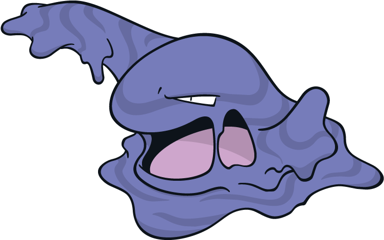

# Swamp-Chess-Engine

Swamp is a chess engine, created to fulfill the project requirement of the course CSE 3812 at UIU .
 

  

### Features

- UCI (Universal Chess Interface) communication
- A full frontend to interact with the engine through the Browser
- A CLI application for interacting with engine through the CLI
- A Java Server to facilitate communication between the frontend and backend
- Uses Stock fish NNUE for doing position evaluations.

### Build Environment

- OS : Linux (Debian) , Windows 11
- Compiler : gcc only (for C), Java JDK

### How To Build (Do in Order)

#### Engine

- cd into "./Swamp Server/"
- gcc Swamp.c -pthread -static

#### Java Server

- java Server.java

#### web-gui-interface

- copy the path of the index.html file and paste on browser

> [!important]
> the C code invokes GCC (GNU C Compiler) compiler specific codes, building the server with other compilers will most probably not work.

> [!important]
> the Engine relies on pthreads to establish multithreading, the building compiler needs to have access to the pthread .so or .dll library

### ELO graph

  

